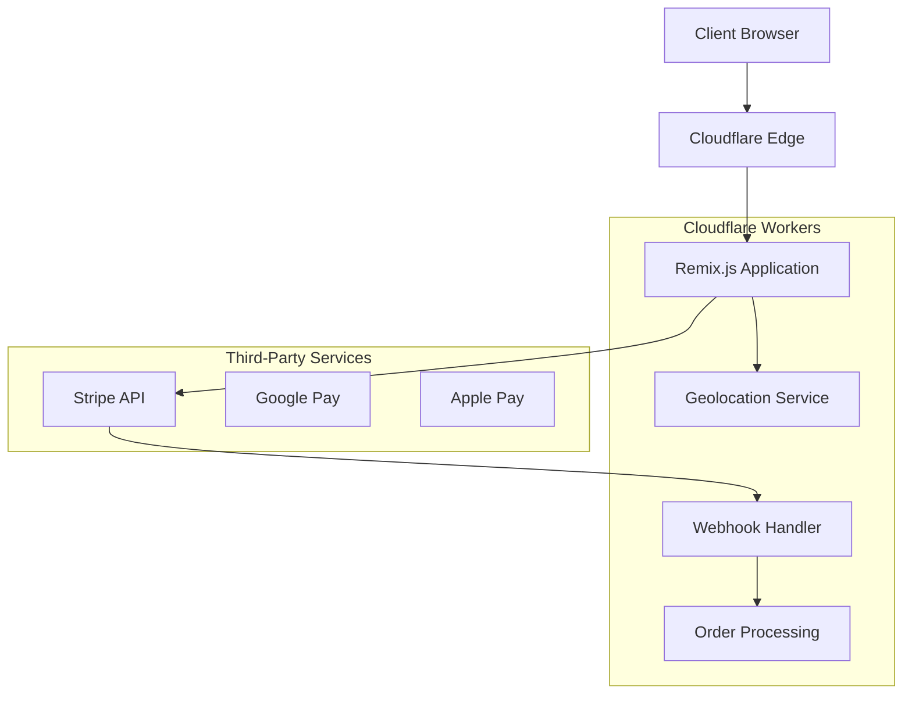
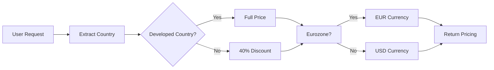
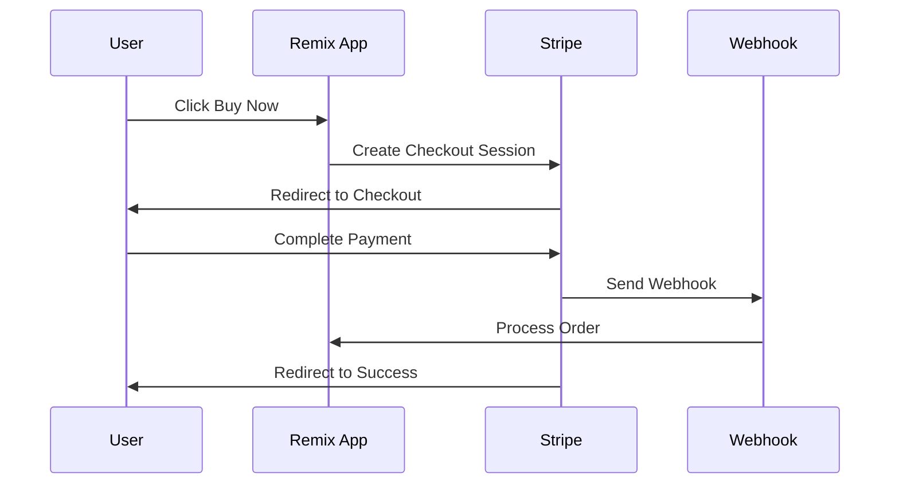

# Architecture Documentation

## 🏗️ System Architecture Overview

The Victorinox Tomato Knife e-commerce application follows a modern, edge-first architecture designed for global performance and scalability.

## 📊 High-Level Architecture



## 🔧 Technology Stack

### Frontend Layer

- **Framework**: Remix.js v2.8.1
- **Language**: TypeScript
- **Styling**: Tailwind CSS v3.4.1
- **Animations**: Framer Motion v11.0.8
- **Build Tool**: Remix Dev with Vite

### Backend Layer

- **Runtime**: Cloudflare Workers
- **Platform**: Cloudflare Pages
- **Language**: TypeScript on V8 Engine
- **API**: RESTful endpoints via Remix loaders/actions

### Payment Processing

- **Primary**: Stripe Checkout v14.21.0
- **Methods**: Credit Cards, Google Pay, Apple Pay
- **Security**: PCI DSS Level 1 compliance via Stripe
- **Webhooks**: Serverless event handling

### Infrastructure

- **Hosting**: Cloudflare Pages
- **CDN**: Cloudflare Global Network
- **Edge Computing**: 300+ global locations
- **DNS**: Cloudflare DNS with geolocation

## 🏛️ Application Architecture

### Remix.js Application Structure

```plaintext
app/
├── root.tsx                 # Application shell, global providers
├── entry.client.tsx         # Client-side hydration
├── entry.server.tsx         # Server-side rendering
├── routes/                  # File-based routing
│   ├── _index.tsx          # Landing page (/)
│   ├── checkout.tsx        # Checkout flow (/checkout)
│   ├── success.tsx         # Order confirmation (/success)
│   └── api/                # API endpoints
│       └── stripe-webhook.tsx
├── components/             # Reusable UI components
│   ├── ProductCard.tsx     # Main product display
│   ├── LanguageSelector.tsx # i18n language switcher
│   └── ui/                 # Base UI components
├── utils/                  # Business logic utilities
│   ├── i18n.ts            # Internationalization
│   ├── countries.ts       # Geographic data
│   ├── pricing.ts         # Pricing calculations
│   └── stripe.server.ts   # Stripe server utilities
└── styles/                # Global CSS
    └── tailwind.css       # Tailwind utilities
```

## 🌐 Data Flow Architecture

### 1. Request Flow

```plaintext
User Request → Cloudflare Edge → Geolocation → Remix Loader → Response
```

### 2. Pricing Logic Flow



### 3. Checkout Flow



## 🔄 Component Architecture

### Component Hierarchy

```plaintext
App (root.tsx)
├── Header
│   ├── Logo (Victorinox)
│   └── LanguageSelector
├── Main
│   └── ProductCard
│       ├── ImageGallery (17 images)
│       ├── ProductInfo
│       ├── FeatureList
│       ├── RandomAvailability
│       ├── PriceDisplay
│       └── BuyButton
└── Footer
```

### State Management

- **Local State**: React useState for UI interactions
- **Server State**: Remix loaders for data fetching
- **Form State**: Remix actions for mutations
- **Global State**: Context providers for theme/language

## 💾 Data Architecture

### Data Sources

1. **Static Data**: Countries, translations, product info
2. **Runtime Data**: Geolocation, pricing calculations
3. **External APIs**: Stripe payment processing
4. **User Input**: Checkout forms, language preferences

### Data Models

#### Product Model

```typescript
interface Product {
  id: string;
  name: string;
  description: string;
  basePrice: {
    EUR: number;
    USD: number;
  };
  features: string[];
  images: ProductImage[];
  colors: ColorOption[];
}
```

#### Pricing Model

```typescript
interface PricingData {
  originalPrice: number;
  finalPrice: number;
  currency: 'EUR' | 'USD';
  hasDiscount: boolean;
  discountPercentage: number;
  country: string;
}
```

#### Order Model

```typescript
interface Order {
  sessionId: string;
  product: Product;
  pricing: PricingData;
  customer: CustomerData;
  status: OrderStatus;
  createdAt: Date;
}
```

## 🌍 Internationalization Architecture

### Translation System

```typescript
// Translation key structure
interface Translations {
  [language: string]: {
    product: ProductTranslations;
    pricing: PricingTranslations;
    checkout: CheckoutTranslations;
    common: CommonTranslations;
  };
}
```

### Language Detection Flow

1. Check URL parameter (`?lang=en`)
2. Read Accept-Language header
3. Fallback to English (en)
4. Store preference in localStorage

### RTL Support

- CSS logical properties for layout
- Direction-aware flexbox
- Arabic text rendering optimization

## 🔒 Security Architecture

### Authentication & Authorization

- **No user accounts**: Single-product checkout flow
- **Session management**: Secure HTTP-only cookies
- **CSRF protection**: Built-in Remix protection

### Payment Security

- **PCI Compliance**: Stripe handles all card data
- **Webhook Verification**: Cryptographic signature validation
- **HTTPS Enforcement**: TLS 1.3 via Cloudflare

### Data Protection

- **Minimal Data Collection**: Only necessary for orders
- **GDPR Compliance**: Data processing transparency
- **No Persistent Storage**: Stateless application design

## ⚡ Performance Architecture

### Rendering Strategy

- **SSR**: Server-side rendering for SEO
- **Hydration**: Progressive enhancement
- **Code Splitting**: Route-based automatic splitting
- **Prefetching**: Critical resource preloading

### Caching Strategy

```plaintext
Browser Cache
├── Static Assets (1 year)
├── Images (6 months)
├── CSS/JS (1 month)
└── HTML (no cache)

Cloudflare Cache
├── Global CDN
├── Edge Caching
├── Smart Routing
└── Image Optimization
```

### Bundle Optimization

- **Tree Shaking**: Remove unused code
- **Minification**: Compress assets
- **Compression**: Gzip/Brotli
- **Critical CSS**: Inline above-fold styles

## 🔄 Error Handling Architecture

### Error Boundaries

```typescript
// Error handling hierarchy
App Level → Route Level → Component Level → Function Level
```

### Error Types

1. **Network Errors**: Retry with exponential backoff
2. **Payment Errors**: User-friendly messages + support
3. **Validation Errors**: Real-time form feedback
4. **Server Errors**: Graceful degradation

### Monitoring & Logging

- **Client Errors**: Browser console + optional Sentry
- **Server Errors**: Cloudflare Workers logs
- **Payment Errors**: Stripe Dashboard monitoring
- **Performance**: Core Web Vitals tracking

## 🧪 Testing Architecture

### Testing Strategy

```plaintext
Unit Tests (Jest + React Testing Library)
├── Components
├── Utilities
└── Business Logic

Integration Tests (Playwright)
├── Payment Flow
├── Multi-language
└── Responsive Design

E2E Tests (Stripe Test Mode)
├── Full Purchase Flow
├── Webhook Processing
└── Error Scenarios
```

## 🚀 Deployment Architecture

### Build Process

```plaintext
graph LR
    A[Source Code] --> B[TypeScript Check]
    B --> C[Remix Build]
    C --> D[Tailwind Process]
    D --> E[Bundle Optimization]
    E --> F[Cloudflare Deploy]
```

### Environment Strategy

- **Development**: Local with Stripe test mode
- **Staging**: Cloudflare Pages preview
- **Production**: Cloudflare Pages with live Stripe

### Deployment Pipeline

1. **Code Push**: Git commit triggers build
2. **Build Process**: Remix build + optimization
3. **Testing**: Automated test suite
4. **Deploy**: Cloudflare Pages deployment
5. **Verification**: Health checks + smoke tests

## 🔧 Configuration Architecture

### Environment Variables

```typescript
interface Environment {
  // Stripe
  STRIPE_SECRET_KEY: string;
  STRIPE_PUBLISHABLE_KEY: string;
  STRIPE_WEBHOOK_SECRET: string;

  // Application
  NODE_ENV: 'development' | 'production';
  APP_URL: string;

  // Optional
  GOOGLE_ANALYTICS_ID?: string;
  SENTRY_DSN?: string;
}
```

### Configuration Files

- **Remix**: `remix.config.js` - Framework configuration
- **Tailwind**: `tailwind.config.js` - Styling system
- **TypeScript**: `tsconfig.json` - Type checking
- **Cloudflare**: `wrangler.toml` - Deployment config

## 📈 Scalability Considerations

### Horizontal Scaling

- **Stateless Design**: No server-side sessions
- **Edge Computing**: Distributed processing
- **CDN Distribution**: Global content delivery
- **Auto-scaling**: Cloudflare handles traffic spikes

### Performance Optimization

- **Image Optimization**: WebP + lazy loading
- **Resource Hints**: Preload critical resources
- **Service Worker**: Offline capabilities (future)
- **Database**: None required for current scope

### Future Enhancements

- **Inventory Management**: Database integration
- **User Accounts**: Authentication system
- **Analytics**: Advanced tracking
- **A/B Testing**: Feature flags
- **Multi-product**: Product catalog expansion

## 🔗 Integration Points

### External Services

- **Stripe**: Payment processing
- **Cloudflare**: Infrastructure + CDN
- **Google/Apple**: Payment methods
- **Victorinox**: Logo + branding assets

### API Endpoints

```plaintext
GET  /                    # Landing page
POST /checkout           # Create payment session
GET  /success           # Order confirmation
POST /api/stripe-webhook # Payment notifications
```

### Webhook Events

- `checkout.session.completed` → Order fulfillment
- `payment_intent.payment_failed` → Error handling
- `customer.created` → Customer management (future)

This architecture ensures high performance, security, and maintainability while providing excellent user experience across all devices and regions.
